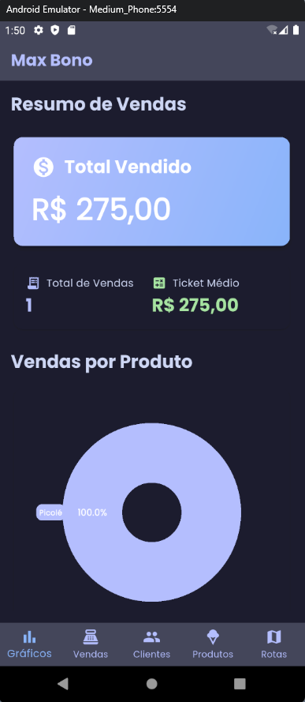

# Projeto de Gerenciamento de Vendas para uma transportadora de sorvetes

Este é um projeto de gerenciamento de vendas com foco em clientes, produtos, rotas e vendas. A aplicação oferece uma interface para visualizar e gerenciar esses dados, com integração a um banco de dados local (Isar).

## Estrutura do Projeto

A estrutura do projeto é composta por várias camadas que fazem parte da recomendação oficial do time de desenvolvimento do flutter, incluindo:

- **Model**: Definem as entidades que representam os dados.
- **Service**: Operações com o banco de dados.
- **Repository**: Opera sobre a service e aplica lógica de negócio ao banco de dados.
- **ViewModel**: Interage com os dados e se comunica com a interface do usuário, gerenciando a lógica de apresentação.
- **Interfaces de Usuário (Screen)**: São as telas da aplicação, incluindo a visualização de clientes, produtos, rotas e vendas.

## Funcionalidades

- **Gerenciamento de Clientes**: Visualização e manipulação de dados de clientes.
- **Gerenciamento de Produtos**: Visualização e manipulação de dados de produtos.
- **Gerenciamento de Rotas**: Acompanhamento e planejamento de rotas.
- **Gerenciamento de Vendas**: Monitoramento das vendas realizadas.
- **Geração de gráficos**: Monitoramento das vendas realizadas.
## Screenshots

### Tela Inicial

### Adição de rota

### Visualização de clientes

### Adição de vendas

### Gráfico

